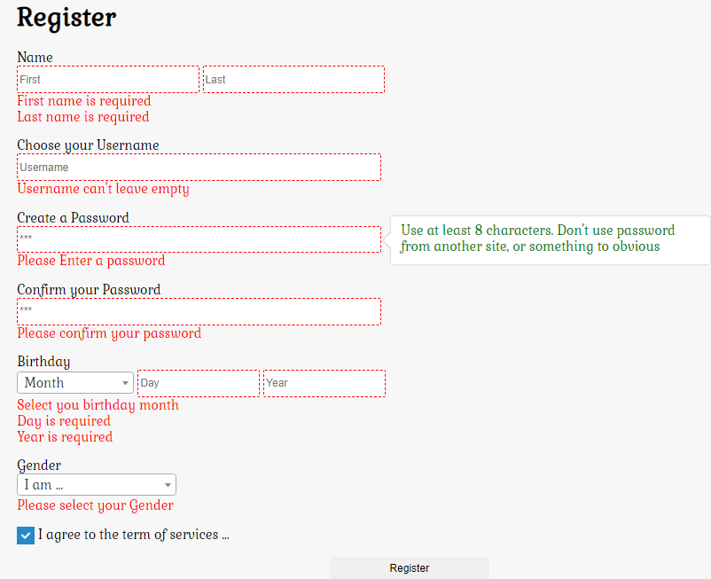

# Jquery Validation
### simple form validation using [jquery-validation](https://jqueryvalidation.org/)
### and example of using [select2](https://select2.org/) and [jBox](https://stephanwagner.me/jBox),  [iCheck](http://icheck.fronteed.com/)

## Preview



## with Jquery Validation you can easily define rules

```js
rules: {
    fname: "required",
    lname: "required",
    username: {
        required: true,
        username: true,
    },
    password: {
        required: true,
        minlength: 8,
    },
    c_password: {
        required: true,
        confirm_password: true
    },
    month: "required",

    day: {
        required: true,
        number: true,
        min: 1,
        max: 31
    },
    year: {
        required: true,
        number: true,
        min: 1800,
        max: 2020
    },
    gender: "required",
    agree: "required",
}
```

## Custom validation methods

```js
jquery.validator.addMethod("username", function (value, element) {

    return this.optional(element) || value == value.match(/^[a-zA-Z._]+$/);

}, "a-z, A-Z, ' . ' and ' _ ' only please");

jquery.validator.addMethod("confirm_password", function (value, element) {

    return this.optional(element) || value === jquery('#password').val();

}, "password does not match");
```
